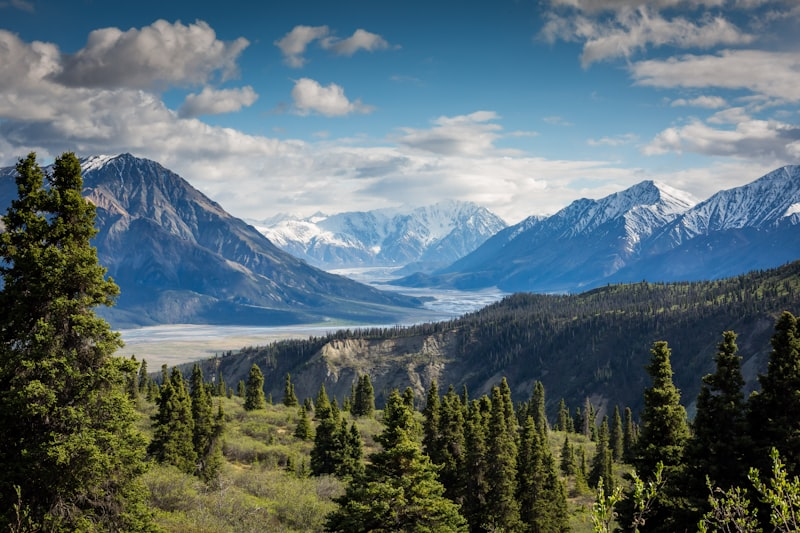
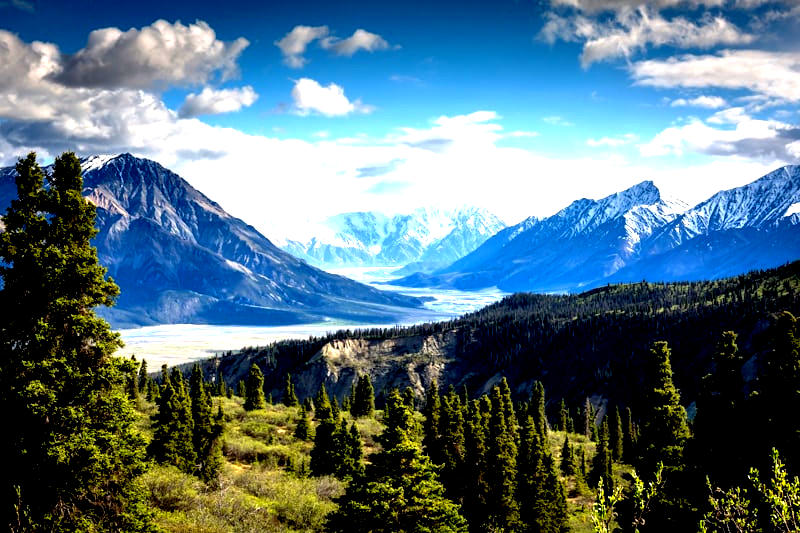
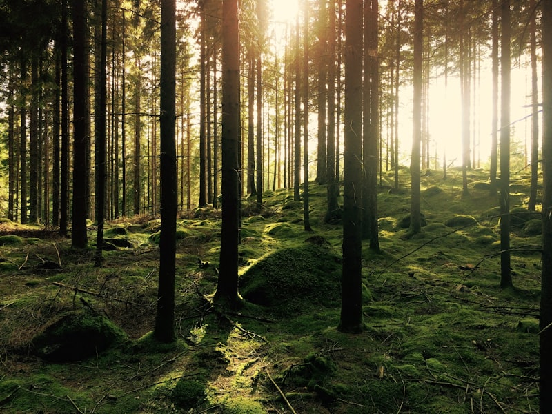
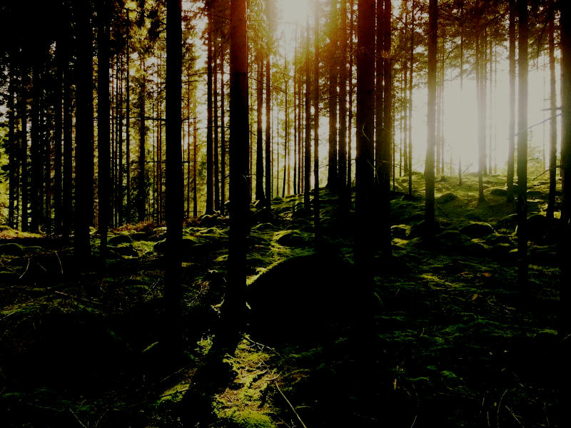
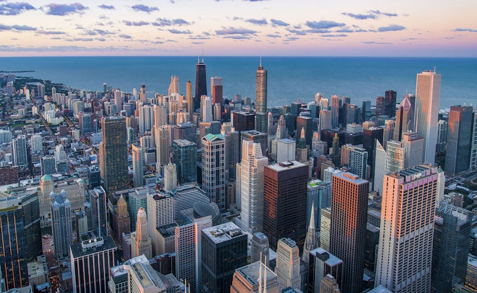
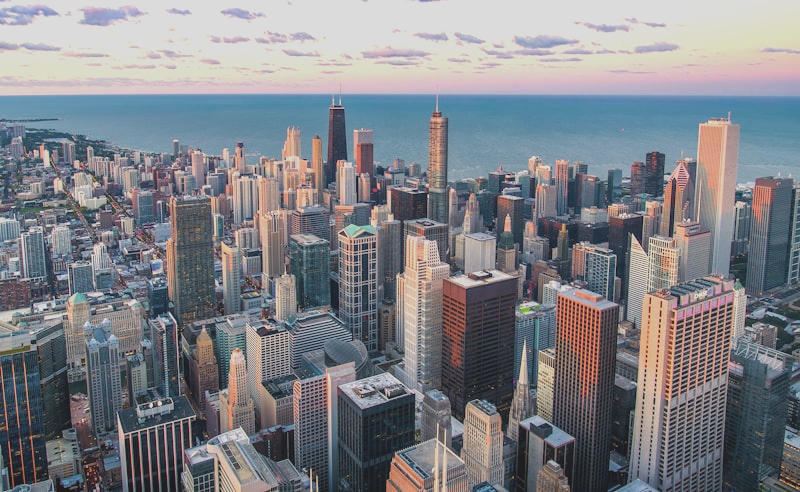

# oxiraw

An open-source photo editing library and CLI written in Rust, with a portable, human-readable preset format.

## Features

- **Tone adjustments**: exposure, contrast, highlights, shadows, whites, blacks
- **White balance**: temperature and tint shifts
- **Raw format support**: decode CR2, CR3, NEF, ARW, RAF, DNG, and 1000+ camera formats via LibRaw
- **3D LUT support**: apply `.cube` LUT files for color grading and film emulation
- **TOML presets**: human-readable, shareable, version-controllable editing presets
- **Library + CLI**: use as a Rust library or through the command-line interface

## Sample Images

Three source photos are included in `example/images/` along with five presets in `example/presets/`.

### Before & After

| Original | Preset | Result |
|:--:|:--:|:--:|
|  | `high-contrast.toml` |  |
|  | `moody-dark.toml` |  |
|  | `golden-hour.toml` |  |

### Presets

| Preset | Style |
|--------|-------|
| `golden-hour.toml` | Warm, lifted shadows, pulled highlights — late afternoon look |
| `moody-dark.toml` | Dark, contrasty, cool tones — cinematic mood |
| `high-contrast.toml` | Punchy contrast with extended tonal range |
| `faded-film.toml` | Low contrast, lifted blacks, warm tint — vintage film feel |
| `cool-blue.toml` | Cool temperature shift with gentle contrast |

Try them out:

```bash
cargo run -p oxiraw-cli -- apply \
  -i example/images/moody-forest.jpg \
  -p example/presets/golden-hour.toml \
  -o edited.jpg
```

## Quick Start

```bash
# Apply a preset to an image
cargo run -p oxiraw-cli -- apply \
  -i example/images/mountain-landscape.jpg \
  -p example/presets/golden-hour.toml \
  -o edited.jpg

# Edit with inline parameters
cargo run -p oxiraw-cli -- edit \
  -i example/images/moody-forest.jpg \
  -o edited.jpg \
  --exposure 1.0 --contrast 25 --temperature 30

# Apply a .cube LUT
cargo run -p oxiraw-cli -- edit \
  -i example/images/city-skyline.jpg \
  -o graded.jpg \
  --lut film-emulation.cube

# Combine adjustments with a LUT
cargo run -p oxiraw-cli -- edit \
  -i example/images/mountain-landscape.jpg \
  -o graded.jpg \
  --exposure 0.5 --contrast 10 --lut film-emulation.cube

# Process a raw file (CR2, NEF, ARW, DNG, etc.)
cargo run -p oxiraw-cli -- edit \
  -i photo.dng \
  -o edited.jpg \
  --exposure 0.5 --contrast 15
```

## Preset Format

Presets are TOML files with a simple, declarative structure:

```toml
[metadata]
name = "Golden Hour"
version = "1.0"
author = "oxiraw"

[tone]
exposure = 0.5       # stops, -5.0 to +5.0
contrast = 15.0      # -100 to +100
highlights = -30.0   # -100 to +100
shadows = 25.0       # -100 to +100
whites = 10.0        # -100 to +100
blacks = -5.0        # -100 to +100

[white_balance]
temperature = 40.0   # warm (+) / cool (-)
tint = 5.0           # magenta (+) / green (-)
```

Presets can also reference a `.cube` LUT file:

```toml
[lut]
path = "film-emulation.cube"   # resolved relative to the preset file
```

Missing values default to neutral (no change). See `example/presets/` for more examples.

## Library Usage

```rust
use oxiraw::{Engine, Lut3D, Preset};
use oxiraw::decode::decode;
use oxiraw::encode::encode_to_file;

// Decode an image (auto-detects format: JPEG, PNG, TIFF, CR2, NEF, DNG, etc.)
let image = decode("photo.jpg".as_ref()).unwrap();

// Create engine and apply a preset
let mut engine = Engine::new(image);
let preset = Preset::load_from_file("preset.toml".as_ref()).unwrap();
engine.apply_preset(&preset);

// Or set parameters directly
engine.params_mut().exposure = 1.0;
engine.params_mut().contrast = 20.0;

// Apply a .cube LUT
let lut = Lut3D::from_cube_file("film.cube".as_ref()).unwrap();
engine.set_lut(Some(lut));

// Render and save
let result = engine.render();
encode_to_file(&result, "output.jpg".as_ref()).unwrap();
```

## Project Structure

```
oxiraw/
├── crates/
│   ├── oxiraw/          # core library
│   │   └── src/
│   │       ├── adjust/  # adjustment algorithms
│   │       ├── decode/  # image decoding (sRGB → linear)
│   │       ├── encode/  # image encoding (linear → sRGB)
│   │       ├── engine/  # rendering engine
│   │       ├── lut/     # 3D LUT parsing and interpolation
│   │       ├── preset/  # TOML preset serialization
│   │       └── error.rs # error types
│   └── oxiraw-cli/      # CLI wrapper
├── example/             # sample images, presets, and LUTs
└── docs/                # design docs, plans, and references
```

## Architecture

The engine uses an **always-re-render-from-original** model: the original image is stored immutably, and every render applies all adjustments from scratch. This makes the system order-independent from the user's perspective — presets are purely declarative parameter values, not operation sequences.

All processing happens in **sRGB** color space. Exposure and white balance operate in linear sRGB; contrast, highlights, shadows, whites, blacks, and LUTs operate in sRGB gamma space. See `docs/reference/color-spaces.md` for a detailed explanation.

## Building with Raw Support

Raw format decoding requires [LibRaw](https://www.libraw.org/) installed on your system:

```bash
# macOS
brew install libraw

# Ubuntu/Debian
sudo apt install libraw-dev
```

The CLI enables raw support by default. To use the library without raw support (no LibRaw dependency):

```toml
# Cargo.toml — no "raw" feature, only standard formats
[dependencies]
oxiraw = "0.1"
```

## Running Tests

```bash
cargo test --workspace
```

## Image Credits

Sample photos from [Unsplash](https://unsplash.com) (free to use under the [Unsplash License](https://unsplash.com/license)).

## License

Licensed under either of

- [Apache License, Version 2.0](LICENSE-APACHE)
- [MIT License](LICENSE-MIT)

at your option.
