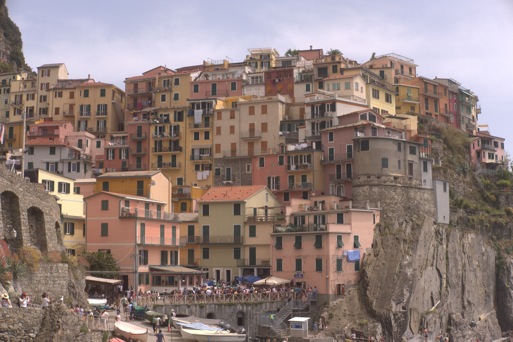
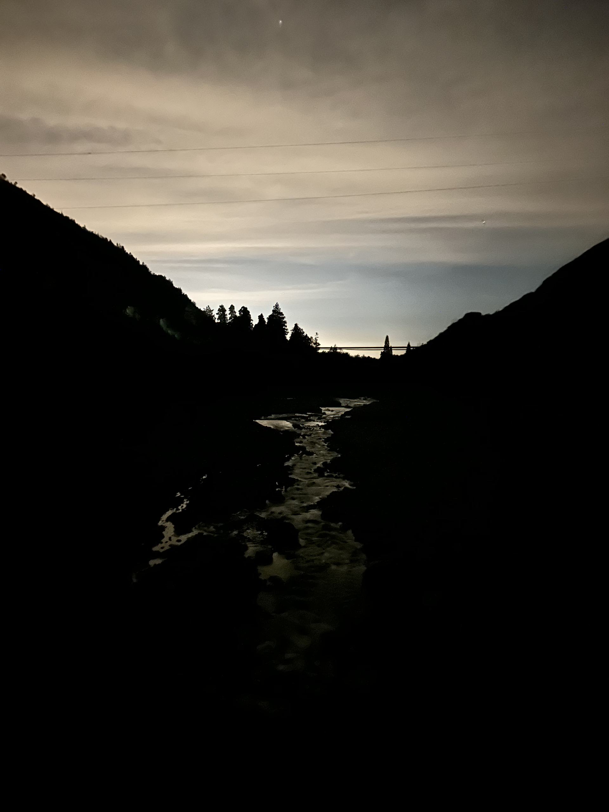

# AgX

An open-source photo editing library and CLI written in Rust, with a portable, human-readable preset format.

**AgX** is the chemical notation for silver halide — the light-sensitive compound in photographic film. Ag is silver, X is a halide. Silver halide crystals capture light and undergo oxidation-reduction to form the latent image — the invisible precursor to every photograph ever developed in a darkroom. A photo editing library written in Rust, named after the chemistry that started it all.

## Philosophy

AgX is a **preset-first** photo editing tool. The goal is not to replace Lightroom or Capture One — it's to make photo editing accessible through composable, shareable, human-readable presets.

- **Presets as recipes**: a preset is a complete editing recipe in a single TOML file. Presets can extend other presets, override selectively, and compose into layered looks.
- **Batch-oriented**: apply a look to an entire shoot in one command. The CLI and library API are designed for processing many images quickly, not pixel-level retouching.
- **Shareable by design**: presets are plain text, version-controllable, and portable.
- **CLI and API first**: AgX is a library and a command-line tool. The core value lives in the editing engine and preset format.

For the longer discussion of what these mean and what AgX deliberately isn't, see [Preset-first philosophy](https://zhjngli.github.io/AgX/explanation/concepts/philosophy.html).

## Features

- **Tone adjustments**: exposure, contrast, highlights, shadows, whites, blacks
- **White balance**: temperature and tint shifts
- **HSL adjustments**: per-channel hue, saturation, and luminance targeting
- **3D LUT support**: apply `.cube` LUT files for color grading and film emulation
- **EXIF orientation**: automatic orientation correction for standard formats (JPEG, PNG, TIFF) and HEIF containers
- **Preset composability**: presets can `extend` a base preset, with Option-style inheritance
- **Raw format support**: decode CR2, CR3, NEF, ARW, RAF, DNG, and 1000+ camera formats via LibRaw
- **HEIF container support**: decode HEIC and HEIF files (iPhone default capture format) via libheif
- **Batch processing**: process entire directories with parallel execution via rayon
- **TOML presets**: human-readable, shareable, version-controllable editing presets
- **Metadata preservation**: EXIF and ICC profiles carried through the pipeline
- **Library + CLI**: use as a Rust library or through the command-line interface

## Install

```bash
cargo install agx-cli
```

The CLI is published as [`agx-cli`](https://crates.io/crates/agx-cli). The library is published as [`agx-photo`](https://crates.io/crates/agx-photo) (the bare `agx` name is taken on crates.io by an unrelated crate).

For source builds, see the [contributing docs](docs/contributing/developer-workflow.md).

## Sample Images

These before/after pairs are from the e2e test suite — each processed through the full decode, engine render, and encode pipeline with a film-inspired look preset and 3D LUT.

### Before & After

| Original | Look | Result |
|:--:|:--:|:--:|
|  | Portra 400 |  |
|  | Kodachrome 64 |  |
|  | B&W High Contrast |  |

## Quick Start

```bash
# Apply a preset to an image
agx apply \
  -i example/images/cinque_terre_window.jpg \
  -p example/presets/golden-hour.toml \
  -o edited.jpg

# Edit with inline parameters
agx edit \
  -i example/images/cinque_terre_window.jpg \
  -o edited.jpg \
  --exposure 1.0 --contrast 25 --temperature 30

# Apply a .cube LUT to a vivid wide-gamut HEIC
agx edit \
  -i example/images/marina_sunset.heic \
  -o graded.jpg \
  --lut film-emulation.cube

# Combine adjustments with a LUT on a wide-gamut source
agx edit \
  -i example/images/marina_sunset.heic \
  -o graded.jpg \
  --exposure 0.5 --contrast 10 --lut film-emulation.cube

# Process a raw file (RAF, CR2, NEF, ARW, DNG, etc.)
agx edit \
  -i example/images/cinque_terre_manarola.raf \
  -o edited.jpg \
  --exposure 0.5 --contrast 15

# Batch process a directory
agx batch-edit \
  --input-dir photos/ \
  --output-dir edited/ \
  --exposure 0.5 --contrast 10

# Set JPEG output quality (default: 92)
agx edit \
  -i photo.jpg \
  -o output.jpg \
  --quality 95

# Specify output format explicitly
agx edit \
  -i example/images/cinque_terre_manarola.raf \
  -o output.tiff \
  --format tiff
```

### Metadata Preservation

Metadata (EXIF, ICC profiles) is automatically preserved from input to output:

- **JPEG/PNG**: Lossless byte-level copy via `img-parts`
- **TIFF-based raw** (CR2, NEF, DNG, ARW): EXIF extracted via `kamadak-exif`
- **Non-TIFF raw** (RAF, RW2, CR3): Key shooting data reconstructed from LibRaw fields

## Preset Format

Presets are TOML files with a simple, declarative structure:

```toml
[metadata]
name = "Golden Hour"

[tone]
exposure = 0.5
contrast = 15.0

[white_balance]
temperature = 40.0

[lut]
path = "film-emulation.cube"
```

For the full schema (every field, type, range, default), see the [preset format reference](https://zhjngli.github.io/AgX/reference/preset.html). For the patch-on-baseline mental model behind the design, see the [preset model explanation](https://zhjngli.github.io/AgX/explanation/concepts/preset-model.html).

## Library Usage

```rust
use agx::{Engine, Lut3D, Preset};
use agx::decode::decode;
use agx::encode::encode_to_file;

// Decode an image (auto-detects format: JPEG, PNG, TIFF, HEIC, HEIF, CR2, NEF, DNG, etc.)
let image = decode("photo.jpg".as_ref()).unwrap();

// Create engine and apply a preset
let mut engine = Engine::new(image);
let preset = Preset::load_from_file("preset.toml".as_ref()).unwrap();
engine.apply_preset(&preset);

// Or set parameters directly
engine.params_mut().exposure = 1.0;
engine.params_mut().contrast = 20.0;

// Apply a .cube LUT
let lut = Lut3D::from_cube_file("film.cube".as_ref()).unwrap();
engine.set_lut(Some(lut));

// Render and save
let result = engine.render();
encode_to_file(&result, "output.jpg".as_ref()).unwrap();
```

## Project Structure

```
agx/
├── crates/
│   ├── agx/             # core library
│   ├── agx-cli/         # CLI wrapper
│   ├── agx-e2e/         # e2e test suite
│   ├── agx-docgen/      # docs auto-generation
│   └── agx-lut-gen/     # dev tool for .cube LUTs
├── example/             # sample images, presets, LUTs
├── scripts/             # verify.sh, e2e.sh, etc.
└── docs/                # design docs, contributing guides
```

See [ARCHITECTURE.md](ARCHITECTURE.md) for the module dependency graph and rules.

## Architecture

The engine uses an **always-re-render-from-original** model: the original image is stored immutably, and every render applies all adjustments from scratch. Internal processing happens in **linear Rec.2020** for physical operations and **gamma-encoded Rec.2020** for perceptual operations; decode brackets inputs into the working space and encode brackets back to 8-bit sRGB. Adjustments are applied in a fixed pipeline order regardless of the order parameters appear in presets.

For the contract (dependency rules, invariants, structural tests), see [ARCHITECTURE.md](ARCHITECTURE.md). For the discussion of why the architecture is shaped this way, see the [architecture explanation](https://zhjngli.github.io/AgX/explanation/concepts/architecture.html).

## Testing

```bash
# Fast checks (format, clippy, unit tests, architecture tests, doc links)
./scripts/verify.sh

# Full e2e suite (builds CLI in release, runs 54 golden comparisons)
./scripts/e2e.sh

# Regenerate golden files
GOLDEN_UPDATE=1 cargo test -p agx-e2e
```

The e2e suite tests every fixture image against 9 film-inspired look presets (6 color + 3 B&W), each combining parameter adjustments with generated 33x33x33 `.cube` LUTs. See `crates/agx-e2e/README.md` for details.

## Building with Raw Support

Raw format decoding requires [LibRaw](https://www.libraw.org/) installed on your system:

```bash
# macOS
brew install libraw

# Ubuntu/Debian
sudo apt install libraw-dev
```

The CLI enables raw support by default. To use the library without raw support (no LibRaw dependency):

```toml
# Cargo.toml — no "raw" feature, only standard formats
[dependencies]
agx-photo = "0.1"
```

The library is published as `agx-photo` but its Rust crate name remains `agx`, so existing `use agx::...` imports work unchanged. With raw support:

```toml
[dependencies]
agx-photo = { version = "0.1", features = ["raw"] }
```

## Building with HEIC Support

HEIC/HEIF decoding requires [libheif](https://github.com/strukturag/libheif) installed on your system:

```bash
# macOS
brew install libheif

# Debian/Ubuntu
sudo apt install libheif-dev libheif-plugin-libde265
```

The CLI enables HEIC support by default, the same as raw support. To use the library without HEIC support (no libheif dependency), depend on `agx-photo` without the `heic` feature.

## License

Licensed under either of

- [Apache License, Version 2.0](LICENSE-APACHE)
- [MIT License](LICENSE-MIT)

at your option.
