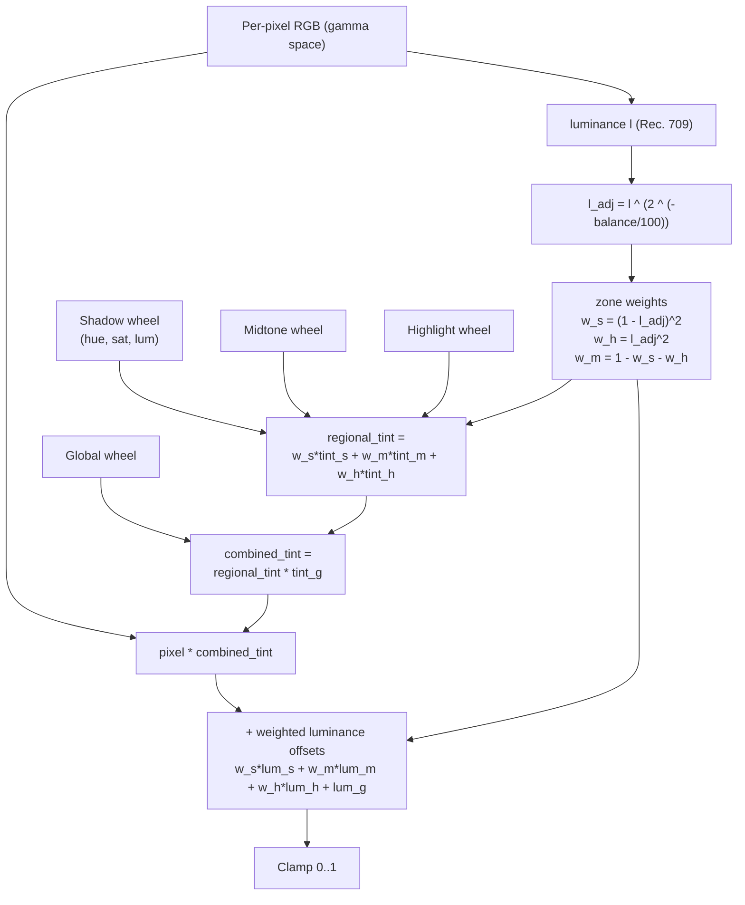

# Color grading

## Pipeline

Each wheel's hue/saturation pair is converted to an RGB `tint` once per render via three cosine lobes spaced 120° apart; the `balance` exponent and the precomputed wheel data are then fixed inputs to the per-pixel inner loop. The three zone weights always sum to one, so regions blend smoothly instead of producing hard boundaries.

{{#include ../../../../../crates/agx/src/adjust/color_grading.md}}

## See also

- Concept references: [Color](../../reference/concepts/color.md) (color grading entry), [Color models](../../reference/concepts/color-models.md)
- API references: [color grading](../../api/agx/adjust/color_grading/index.html)
- Related explanations: [Basic adjustments](basic.md), [HSL](hsl.md), [Tone curves](tone-curves.md)
- How-tos: [Write your own preset](../../how-to/write-preset.md), [Compose layered looks](../../how-to/compose-looks.md)
