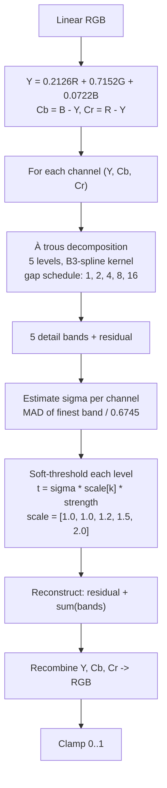

# Noise reduction

## Pipeline

The `luminance`, `color`, and `detail` sliders parameterize the threshold strengths: `luminance` and `color` map to a `0..3` multiplier on `Y` and on `(Cb, Cr)` respectively, while `detail` only protects the finest-scale luminance band by scaling its threshold down toward zero.

{{#include ../../../../../crates/agx/src/adjust/denoise.md}}

## See also

- Concept references: [Detail](../../reference/concepts/detail.md) (noise reduction entry), [Color models](../../reference/concepts/color-models.md)
- API references: [noise reduction](../../api/agx/adjust/denoise/index.html)
- Related explanations: [Detail pass](detail.md), [Dehaze](dehaze.md), [Grain](grain.md)
- How-tos: [Write your own preset](../../how-to/write-preset.md)
