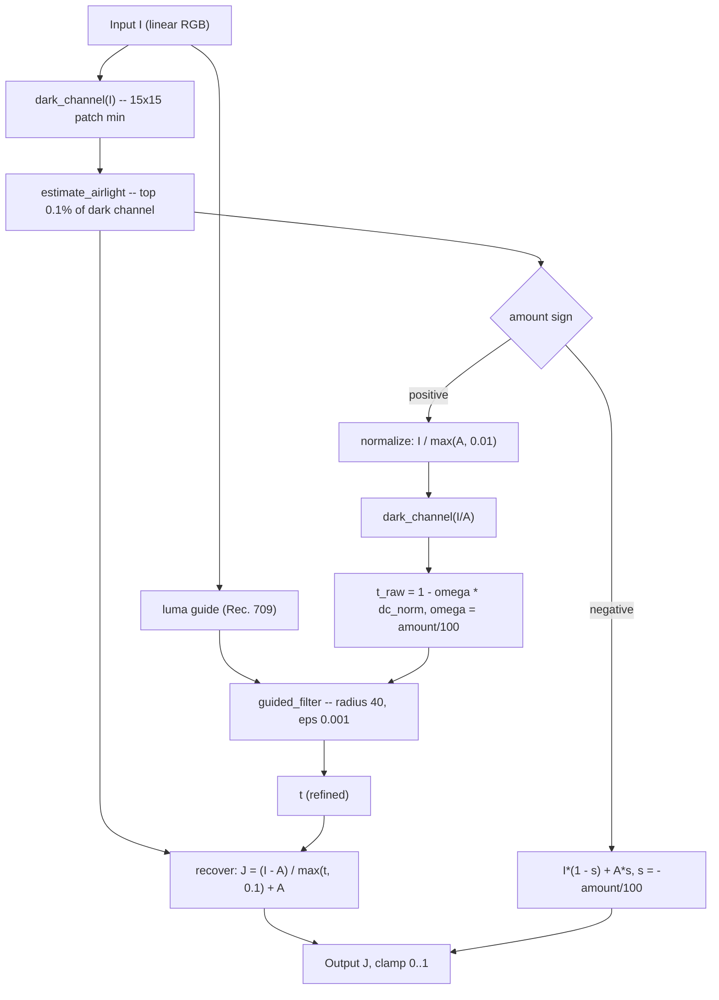

# Dehaze

## Pipeline

Positive `amount` runs the full Dark Channel Prior recovery path; negative `amount` reuses the airlight estimate to add scene-aware fog and skips the transmission and guided-filter stages.

{{#include ../../../../crates/agx/src/adjust/dehaze.md}}

## See also

- Concept references: [Detail](../reference/concepts/detail.md) (dehaze entry)
- API references: [dehaze](../api/agx/adjust/dehaze/index.html)
- Related explanations: [Detail pass](detail.md), [Noise reduction](denoise.md)
