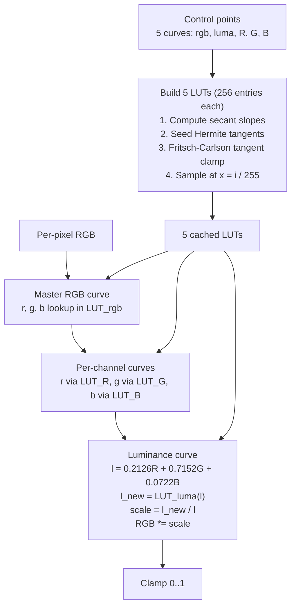

# Tone curves

## Pipeline

The Fritsch-Carlson tangent limiter at LUT-build time is what keeps the cubic Hermite interpolation monotone: regular cubic splines can overshoot between control points, inventing tonal reversals the user never specified, so AgX clamps the tangent magnitudes whenever the standard monotonicity test fails. Identity curves are detected and skipped at lookup time so untouched channels add no work to the hot path.

{{#include ../../../../crates/agx/src/adjust/tone_curves.md}}

## See also

- Concept references: [Tone](../reference/concepts/tone.md) (tone curves entry), [Color models](../reference/concepts/color-models.md) (luminance section)
- API references: [tone curves](../api/agx/adjust/tone_curves/index.html)
- Related explanations: [Basic adjustments](basic.md), [HSL](hsl.md), [Color grading](color-grading.md)
