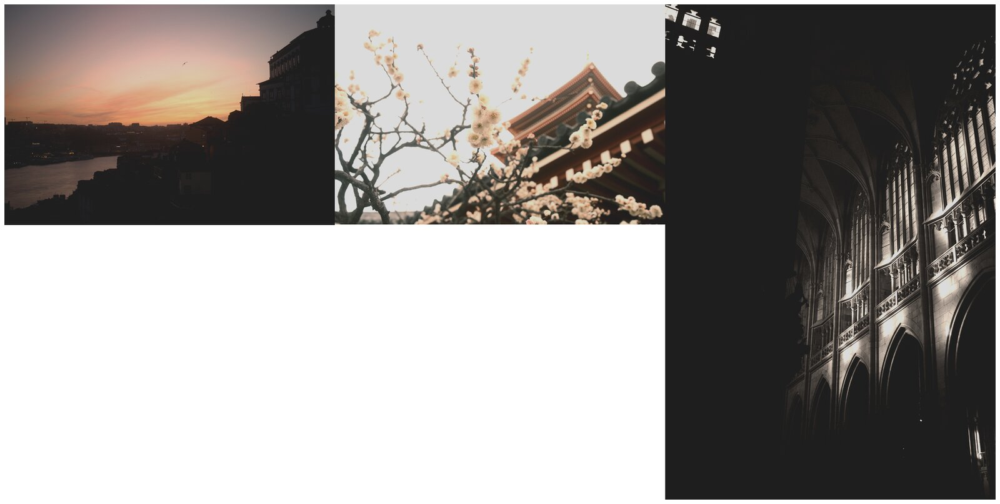

# Apply a preset to a folder of photos

Render every image in a directory through one preset, in parallel.

## Prerequisites

- AgX installed (see [Install](../install.md)).
- A folder of input images.
- A `.toml` preset.

## Steps

```bash
agx-cli batch-apply \
  --preset example/presets/golden-hour.toml \
  --input-dir example/images \
  --output-dir /tmp/golden-hour-out
```

AgX walks the input directory, decodes each image, applies the preset, and writes the result into the output directory using the original filename (with the original extension preserved by default).



## Variations

Recurse into sub-directories:

```bash
agx-cli batch-apply \
  --preset example/presets/golden-hour.toml \
  --input-dir example/images \
  --output-dir /tmp/golden-hour-out \
  --recursive
```

Append a suffix to the output filenames so they don't collide if you ever decide to write outputs back into the input directory:

```bash
agx-cli batch-apply \
  --preset example/presets/golden-hour.toml \
  --input-dir example/images \
  --output-dir /tmp/golden-hour-out \
  --suffix _golden
```

Cap the number of parallel workers (default uses every core):

```bash
agx-cli batch-apply \
  --preset example/presets/golden-hour.toml \
  --input-dir example/images \
  --output-dir /tmp/golden-hour-out \
  --jobs 4
```

Skip files that fail to decode instead of aborting the whole run:

```bash
agx-cli batch-apply \
  --preset example/presets/golden-hour.toml \
  --input-dir example/images \
  --output-dir /tmp/golden-hour-out \
  --skip-errors
```

## See also

- [Compare looks side-by-side](multi-apply.md) — render one image through several presets.
- [Compose layered looks](compose-looks.md) — combine presets in one render.
- [CLI reference](../reference/cli.md)
