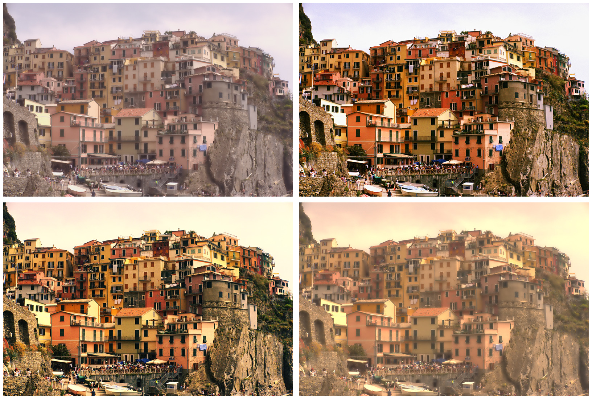

# Compare looks side-by-side on one image

Render one image through several presets in a single command. Useful when you're choosing between presets or auditioning a preset against a base reference.

## Prerequisites

- One input image.
- Two or more `.toml` presets.

## Steps

```bash
agx multi-apply \
  -i example/images/sunset_river.png \
  -p example/presets/golden-hour.toml \
     example/presets/moody-dark.toml \
     example/presets/cool-blue.toml \
  -o /tmp/looks
```

AgX decodes the image once and renders it through each preset. The output directory ends up with one file per preset, named after the source image with the preset basename appended.



## Variations

Include an unprocessed reference render alongside the preset results:

```bash
agx multi-apply \
  -i example/images/sunset_river.png \
  -p example/presets/golden-hour.toml \
     example/presets/moody-dark.toml \
  -o /tmp/looks \
  --noop
```

The `--noop` flag adds a no-preset render so you can compare each preset against the unaltered source.

Run preset renders in parallel (default is `1`, since each render is already internally parallelised across pixels):

```bash
agx multi-apply \
  -i example/images/sunset_river.png \
  -p example/presets/golden-hour.toml \
     example/presets/moody-dark.toml \
     example/presets/cool-blue.toml \
     example/presets/high-contrast.toml \
  -o /tmp/looks \
  --jobs 4
```

## See also

- [Apply a preset to a folder](batch-apply.md) — render many images through one preset.
- [Write your own preset](write-preset.md) — author a preset to add to your comparison set.
- [CLI reference](../reference/cli.md)
