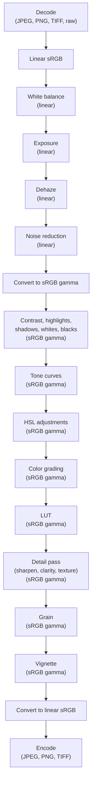

# Render pipeline

A render in AgX takes an input image (decoded from JPEG, PNG, TIFF, or raw) through a fixed sequence of stages and produces an output image. Each stage applies one kind of adjustment in the color space where its math is correct.

## Stages

## Color space discipline

Each stage runs in the color space where its math is physically or perceptually correct. The pipeline does the linear-to-gamma conversion in the middle to switch from physical to perceptual operations.

See [Color spaces](color-spaces.md) for the linear-vs-gamma distinction and per-stage rationale.

## Why pipeline order matters

Stage order is not interchangeable. A few examples:

- **Exposure before tonal sliders.** Exposure scales linear light; tonal sliders re-shape the resulting brightness landscape. Reversing them would re-shape unexposed values, then scale the result, which produces different output.
- **Dehaze and denoise in linear space.** Both operate on physical light intensities — dehaze increases local contrast where atmospheric haze has reduced it, and denoise smooths sensor noise. Running them in linear space (before gamma encoding) keeps the math operating on the same domain the optical effects originate in.
- **Dehaze before denoise.** Dehaze can amplify low-level structure that includes noise; denoise then cleans up the result. Reversing them would let dehaze re-amplify noise that denoise had just removed.
- **LUT inside the per-pixel pass, before detail.** The LUT applies a creative color transform; sharpening and clarity then operate on the graded result. Sharpening before the LUT would amplify edges that the LUT would then re-grade.
- **Grain after detail and dehaze, before vignette.** Grain is added texture; the surrounding stages should not modify it. Vignette is a final overlay that doesn't disturb grain structure.

The stage order encodes design decisions made when each adjustment was added. The [explanation pages](../../explanation/index.md) for each algorithm record the reasoning.

## See also

- [Color spaces](color-spaces.md) — the linear-vs-gamma distinction the pipeline lives in.
- [Preset model](preset-model.md) — how a preset's parameters map to pipeline stages.
- [Explanation index](../../explanation/index.md) — algorithm-by-algorithm walkthroughs in pipeline order.
