# Render pipeline

A render in AgX takes an input image (decoded from JPEG, PNG, TIFF, or raw) through a fixed sequence of stages and produces an output image. Each stage applies one kind of adjustment in the color space where its math is correct.

## Stages

```mermaid
flowchart TD
    Decode["Decode<br/>(JPEG, PNG, TIFF, raw)"]
    LinearEntry["Linear Rec.2020"]
    WB["White balance<br/>(linear)"]
    Exposure["Exposure<br/>(linear)"]
    Dehaze["Dehaze<br/>(linear)"]
    Denoise["Noise reduction<br/>(linear)"]
    LinearToGamma["Linear → Gamma"]
    Tonal["Contrast, highlights,<br/>shadows, whites, blacks<br/>(Gamma Rec.2020)"]
    ToneCurves["Tone curves<br/>(Gamma Rec.2020)"]
    HSL["HSL adjustments<br/>(Gamma Rec.2020)"]
    ColorGrading["Color grading<br/>(Gamma Rec.2020)"]
    LUT["LUT<br/>(Gamma Rec.2020;<br/>LUT sampled in sRGB gamma<br/>via conversion bracket)"]
    Detail["Detail pass<br/>(sharpen, clarity, texture)<br/>(Gamma Rec.2020)"]
    Grain["Grain<br/>(Gamma Rec.2020)"]
    Vignette["Vignette<br/>(Gamma Rec.2020)"]
    GammaToLinear["Gamma → Linear"]
    Encode["Encode<br/>(Linear Rec.2020 → 8-bit sRGB:<br/>matrix + transfer + quantize)"]

    Decode --> LinearEntry
    LinearEntry --> WB
    WB --> Exposure
    Exposure --> Dehaze
    Dehaze --> Denoise
    Denoise --> LinearToGamma
    LinearToGamma --> Tonal
    Tonal --> ToneCurves
    ToneCurves --> HSL
    HSL --> ColorGrading
    ColorGrading --> LUT
    LUT --> Detail
    Detail --> Grain
    Grain --> Vignette
    Vignette --> GammaToLinear
    GammaToLinear --> Encode
```

## Color space discipline

Each stage runs in the color space where its math is physically or perceptually correct. The pipeline does the linear-to-gamma conversion in the middle to switch from physical to perceptual operations. See [Color spaces](color-spaces.md) for the linear-vs-gamma distinction and the per-stage table.

## See also

- [Why pipeline order matters](../../explanation/concepts/render-pipeline.md) — the design rationale for the stage sequence.
- [Color spaces](color-spaces.md) — the linear-vs-gamma distinction the pipeline lives in.
- [Preset model](preset-model.md) — how a preset's parameters map to pipeline stages.
- [Algorithm explanations](../../explanation/algorithms/index.md) — algorithm-by-algorithm walkthroughs in pipeline order.
