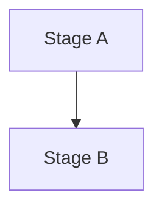

# Documentation conventions

This document describes the conventions for writing documentation in AgX. It is the reference for the rules; the [umbrella documentation initiative](../plans/2026-04-06-documentation-initiative-design.md) explains the rationale.

## Audiences and the Diataxis quadrants

AgX's documentation is organized using the [Diataxis framework](https://diataxis.fr/), which splits documentation into four quadrants based on what the reader wants from the document:

- **Tutorials** are learning-oriented walkthroughs. The reader is new to AgX and wants to be guided through a successful first experience.
- **How-to guides** are task-oriented recipes. The reader knows what they want to accomplish and needs the steps.
- **Reference** is information-oriented. The reader needs to look something up — a CLI flag, a preset field, a function signature, a color space conversion.
- **Explanation** is understanding-oriented. The reader wants to know how something works under the hood and why it was designed that way.

Tutorials and how-to guides live exclusively in mdbook under `docs/book/src/`. Reference content is split: the library API reference is rendered by rustdoc; the CLI reference and preset format reference are rendered by mdbook (auto-generated from `clap::Command` and serde types in a later sub-project); the conceptual reference (color spaces, LUT format, photographic terminology) is hand-written prose under `docs/book/src/reference/concepts/`. Explanation content is split similarly: algorithm explanations live as sibling `.md` files alongside the Rust source and are pulled into both rustdoc and mdbook from the same file; architectural and philosophical explanations live in mdbook only.

## Item-level documentation: `///` comments

Every public item in `crates/agx/` and `crates/agx-cli/` should carry a `///` doc comment.

The first line is an imperative summary (e.g., `/// Decode a raw image file into a linear RGB buffer.`). A blank line separates the summary from any further detail. Optional sections include `# Examples`, `# Errors`, and `# Panics`, in that order. Examples in `# Examples` should compile — `cargo doc` runs them as doctests when the example is in a fenced Rust code block.

Cross-references to other items in the crate use rustdoc's intra-doc link syntax (`` [`Engine`] ``, `` [`crate::adjust::grain`] ``), not raw URLs. The `deny(rustdoc::broken_intra_doc_links)` lint validates these on every `cargo doc` run.

## Module-level documentation: `//!` comments

Every module file should carry a `//!` doc comment that summarizes its contents. For modules in `crates/agx/src/adjust/` whose explanation is shared with the mdbook explanation pages, the prose lives in a sibling `.md` file (see "The shared `.md` file convention" below) instead of being inlined into `//!` lines.

For modules whose `//!` doc is short and not reused on the site, inline `//!` lines are fine — there is no need to introduce a sibling `.md` file just to preserve uniformity.

## The shared `.md` file convention

When a module's explanation is meant to appear in both rustdoc and the mdbook site, the canonical source lives as a markdown file alongside the Rust source. The shared file is a sibling of the `.rs` file. The Rust file pulls it into rustdoc via `#![doc = include_str!("<name>.md")]`; the mdbook page pulls the same file via `{{#include}}`.

The canonical worked example is the grain algorithm. The shared file is `crates/agx/src/adjust/grain.md`. The Rust side at `crates/agx/src/adjust/grain.rs` reads:

```rust
#![doc = include_str!("grain.md")]
//!
//! See [`super::dehaze`] and [`super::denoise`] for related passes.

// ... rest of the file ...
```

The mdbook side at `docs/book/src/explanation/grain.md` reads:

```markdown
# Grain

{{#include ../../../../crates/agx/src/adjust/grain.md}}

## Related

- [Grain API reference](../api/agx/adjust/grain/index.html)
```

There is no anchor mechanism to maintain. The entire shared `.md` file is the explanation content. Editing it updates both surfaces on the next build with no possibility of drift.

Every shared `.md` file starts with an HTML comment block that names the canonical source file and records the bidirectional editing rule:

```markdown
<!-- Canonical source: crates/agx/src/adjust/<name>.rs -->
<!-- If you materially change this prose, verify claims against the CPU
     and GPU implementations. -->
<!-- If you materially change the algorithm in code, update this file
     so the explanation and implementation stay in sync. -->
```

The rule is symmetric: when the algorithm changes materially, update the sibling `.md`; when the sibling `.md` changes materially, verify its claims against the code before committing.

The shared `.md` file should contain only the reusable explanation prose, with no top-level heading and no cross-`.md` links. Reasons:

- Both consuming surfaces add their own outer heading. A heading inside the included file would render twice.
- Cross-file references differ between the two surfaces. Rustdoc intra-doc syntax (`` [`super::dehaze`] ``) does not resolve in mdbook. Conversely, mdbook relative links into `../api/` or another `.md` file do not resolve correctly when included in a rustdoc page. Keeping shared files free of cross-`.md` links avoids the cross-surface link problem.

Cross-references that need rustdoc validation live in inline `//!` lines on the Rust side, **outside** the include. Cross-references that need mdbook resolution live in the wrapping mdbook page, **outside** the include. The grain example demonstrates both patterns. External `https://` links are fine in a shared file because both rustdoc and mdbook render them the same way.

Use GitHub-Flavored Markdown footnotes only within the same shared file. Do not use a footnote in a shared file to point at another source file or mdbook page; put that cross-file reference in the wrapping mdbook file instead.

If a shared algorithm also has WGSL shader implementations, the shader files use the structured header format described in "WGSL shader headers" below.

## WGSL shader headers

Non-common WGSL shader files start with a five-line structured header. Keep the field names and order fixed:

```wgsl
// Algorithm: <short description of the shader pass>
// Canonical explanation: <shared .md or reference page>
// CPU equivalent: <Rust source path and function when applicable>
// Bindings: <storage/uniform bindings in human-readable form>
// Entry points: main
```

The header lets maintainers connect each shader to the canonical prose, the CPU implementation it must match, and the bind groups a dispatcher is expected to provide. Current shader headers use `Entry points: main`, and `scripts/verify.sh wgsl-headers` enforces that convention. Common utility modules under `crates/agx/src/shaders/common/` may use simpler file comments when they are not standalone algorithm passes.

## Linking between surfaces

- **Rustdoc to mdbook:** use raw HTTPS URLs to the deployed site. Rustdoc has no intra-doc syntax for links to mdbook content.

  ```markdown
  See the [grain explanation](https://zhjngli.github.io/AgX/explanation/grain.html) on the project site.
  ```

- **Mdbook to rustdoc:** use relative links into `../api/`. The deploy workflow places rustdoc output at `_site/api/`, so this path is stable on the deployed site.

  ```markdown
  [Grain API reference](../api/agx/adjust/grain/index.html)
  ```

- **Mdbook to mdbook:** use mdbook's native relative-link resolution — relative paths from the file's location to the target file.

  ```markdown
  [Tutorials](../tutorials/index.md)
  ```

- **Rustdoc to rustdoc:** use intra-doc link syntax. The `deny(rustdoc::broken_intra_doc_links)` lint validates these.

  ```rust
  /// See [`crate::adjust::grain`] for the algorithm.
  ```

## Mermaid diagrams in algorithm pages

Larger algorithm pages can include a Mermaid pipeline diagram alongside the prose. Mdbook renders the diagram via the `mdbook-mermaid` preprocessor, which is already wired into `book.toml`.

Diagrams live in the **wrapping mdbook page** (`docs/book/src/explanation/<algo>.md`), not in the shared `.md` file. Rustdoc has no Mermaid support, so a fenced `mermaid` block placed in a shared `.md` would render as raw DSL text in the API reference. Keeping diagrams in the wrapper is consistent with the existing rule that surface-specific content lives outside the include.

The typical structure is:

````markdown
# Algorithm name

## Pipeline



One short paragraph summarizing what the diagram shows.

{{#include ../../../../crates/agx/src/adjust/<algo>.md}}

## Related

- [API reference](../api/agx/adjust/<algo>/index.html)
````

Notes for diagram authors:

- The vendored `mermaid.min.js` and `mermaid-init.js` files in `docs/book/` are gitignored; `scripts/build-docs.sh` and `scripts/verify.sh book-linkcheck` run `mdbook-mermaid install docs/book` before the build to (re)create them.
- Use ASCII-safe label text (avoid `<`, `>`, raw `&`); HTML entities inside Mermaid labels are fragile across mdbook's markdown escaping. Words like `negative` / `positive` are clearer than `< 0` / `> 0` anyway.
- Use `<br/>` inside quoted node labels for line breaks.

## Markdown linting

`scripts/verify.sh markdown-lint` runs [`markdownlint-cli2`](https://github.com/DavidAnson/markdownlint-cli2) against every `.md` file the lint config reaches. The configuration lives at the repo root in `.markdownlint-cli2.jsonc` and follows the published [markdownlint rule list](https://github.com/DavidAnson/markdownlint/blob/main/doc/Rules.md).

Active rules cover blank-line discipline (around headings, lists, fenced blocks, tables), heading style, and trailing whitespace. Several rules are intentionally disabled — see comments in `.markdownlint-cli2.jsonc` for the reasoning. Notable disables:

- `MD013` (line length) — long-form prose.
- `MD041` / `MD025` — many files have leading HTML comments or no top-level heading by design.
- `MD060` (table column style) — existing tables use compact pipes; aligning would be cosmetic.
- `MD040` (fenced-block language hints) — too many existing design-doc blocks to retrofit; new code blocks should still include a hint by convention.
- `MD029` (ordered-list prefix) — auto-fix renumbers intentionally-continued lists, changing apparent semantics.
- `MD037` / `MD038` / `MD039` — math expressions like `w * h * c` collide with emphasis-pair detection; auto-fix corrupts the prose.

Local invocation, when `markdownlint-cli2` is not on `PATH`, falls back to `npx --yes markdownlint-cli2`. CI runs the linter as the `markdown-lint` entry in the docs matrix; Node is installed via `actions/setup-node`.

To autofix the rules that support it (most blank-line rules):

```bash
npx --yes markdownlint-cli2 --fix
```

The `MD040` retrofit and a possible style normalization sweep across older design docs are tracked as future tightening work in [the documentation initiative backlog](../backlog/documentation-initiative.md).

## Active lints

Both `crates/agx/` and `crates/agx-cli/` carry two crate-level lints:

- `#![deny(missing_docs)]` — every public item without a `///` or `//!` doc comment fails the build. This ensures new public API surface is documented before it compiles.
- `#![deny(rustdoc::broken_intra_doc_links)]` — every broken intra-doc link in a `///` or `//!` comment fails `cargo doc`.

`scripts/verify.sh` runs `cargo doc --no-deps --workspace` with `RUSTDOCFLAGS="-D warnings"` so any rustdoc warning becomes a local verify failure.

## Local preview

For rustdoc:

```bash
cargo doc --no-deps --workspace --open
```

For mdbook (after the one-time install of mdbook and the three preprocessors):

```bash
cargo install --locked mdbook --version 0.4.40
cargo install --locked mdbook-linkcheck --version 0.7.7
cargo install --locked mdbook-mermaid --version 0.14.0
cargo install --locked mdbook-katex --version 0.9.0

mdbook serve docs/book --open
```

`mdbook serve` watches for file changes and auto-rebuilds, so the typical author workflow is to keep it running in a terminal while editing.

## Where the deployed site lives

Pushes to `main` trigger `.github/workflows/docs.yml`, which builds and deploys the site to `https://zhjngli.github.io/AgX/`. mdbook content lives at the root (e.g., `https://zhjngli.github.io/AgX/explanation/grain.html`); rustdoc content lives at `/api/` (e.g., `https://zhjngli.github.io/AgX/api/agx/adjust/grain/index.html`).
